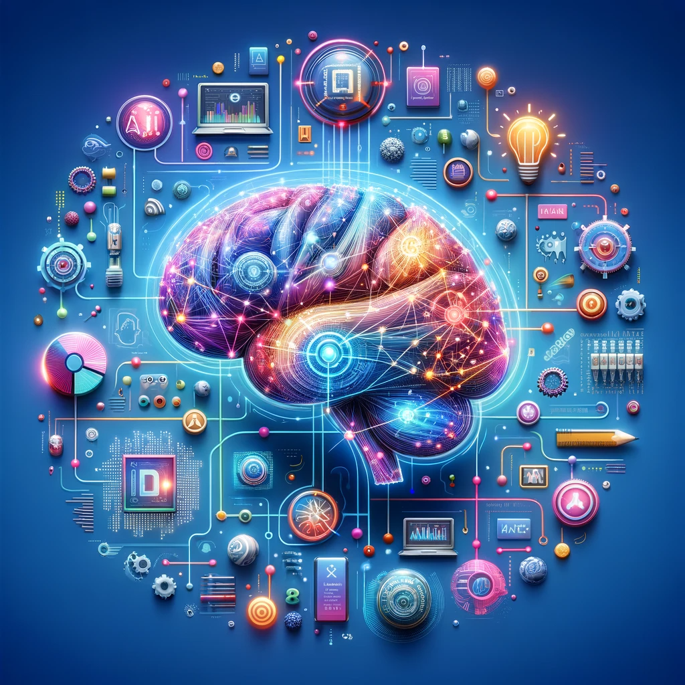

## I. Introduction

	With only a few years of being implemented, we have seen huge impacts of AI in education. While I know it was pretty commonly used in College courses the past couple of years, I was surprised to see that even highschool students were using this powerful tool religiously. It is something that is truly changing the landscape of education and society world wide. Personally, I tried my best to refrain from using AI in any way up until last year. Though I would use it occasionally to clarify concepts I wasn’t fully understanding, it wasn’t until I started ICS 314 where I found professors being open to and almost pushing us to use AI tools like ChatGPT. Within this essay i will go over my perspective on my personal experiences with AI and in what circumstances I have found it helpful in using. My AI tool of choice especially when using this class is the first one that comes to mind for most people, ChatGPT.

## II. Personal Experience with AI
	Within this part of the essay I will touch upon some of the personal experiences I’ve had with AI technology specifically in ICS 314.

### 1. Experience WODs

		Going through this course we went through countless of Experience WODs. These WODs were meant to teach us new content and apply the concept and other things we were learning. Most of these WODs would have the task as well as a video tutorial as to how to how to complete the task. For the most part I tried to refrain from using ChatGPT in these experiences. However there were times where I was unable to figure out the solution or I’ll go through with the video solution but still was getting problems; it would be at this point where I would copy the code that is giving me problems and state the problem within ChatGPT and see if it would be able to help me solve the issue. I would say that this occurred the most when we started doing Postgres and Digits, a lot of the database issues came up and I fully didn’t understand what was going on. For Postgres at times I was stuck on the experience for days even troubleshooting with ChatGPT but essentially it helped me understand what was happening behind the scenes and as to why I couldn’t perform certain tasks with my user such as create a datatable. I also used ChatGPT a lot when converting websites from Bootstrap 5 to React. I felt that it was just more effective and quick.
      
### 2. In-class Practice WODs

		As for the in-class practice WODs, I treated them like the real thing so for the most part I had an ego in a sense that I felt it was important for me to figure out the answer without the use of AI. But I do remember as we got more into UI design and frameworks I struggled really hard with using different components and recreating the actual website. For me I remember explicitly having a really hard time matching the Murphy’s website. I was able to get a lot of the components on there but I used ChatGPT to help me to modify the components to better match the alignment to the actual website. An example would be the main image for the middle of the website. I originally inserted it as an image just for that one area but I ChatGPT showed me that I needed to have it as a background for the whole page instead to get the desired result. I also used it to break down as to why my approach for formatting things in a certain way (using flex boxes etc.) would result in the way it looks opposed to what I was going for.

### 3. In-class WODs

    For the actual in-class WODs I remember in the beginning I was super adamant about making sure that I didn’t use AI. However, as the WODs became more challenging and there was more content to remember, I began using ChatGPT to save my grade. I also found it very useful especially in the website design portion like mentioned previously. I would have it help to realign items correctly and ask it questions about how certain components work to get the desired design of website. It also made converting websites from bootstrap to react a lot easier opposed to starting from scratch.

### 4. Essays

    For the essays I wouldn’t necessarily help me to write it but I used to to clarify certain concepts I didn’t fully understand especially in this most recent essay assignment where we talked about Design Patterns. Aside from researching about design patterns, for my examples I would give ChatGPT exactly what our application was design to do and I would ask it if it fits in with that specific pattern that I thought. There were times that I was wrong about it being in a certain pattern but it gave me one that it matched more to and explained why that might be.

### 5. Final project

    Within the final project I have been using ChatGPT religiously. I’d be lying if I’d say that I remember all the concepts we went through in this course and that are required to build a website. There were times where I forgot some of the basics and had to consult ChatGPT to remind me how components are called through the actually page.tsx file. I also used ChatGPT too debug my problems. If I couldn’t figure out why something wasn’t coming out the way I wanted to, I would put the code into ChatGPT and give it the error I was getting. Most recently I was having trouble differentiating the landing-page of a signed-in vs non signed-in user. ChatGPT helped me to produce the code that allowed the website to write two different functions within the page.tsx file and call one based on if the user was signed-in or not. 

### 6. Learning a concept / tutorial

    As I previously mentioned I needed a lot of help setting up my Postgres on my laptop. For some reason it wouldn’t allow my base user to to execute commands like creating a new database. ChatGPT allowed me to give it my problems and walked me through how to get around these problems. One of them being a sudo command to use the original postgres account and starting up a server. 

### 7. Answering a question in class or in Discord

		I didn’t answer any questions from class nor do I remember answering question on Discord. So I didn’t use AI for this section.

### 8. Asking or answering a smart-question

		I remember running into a problems importing icons when using next.js. I couldn’t figure it out why I couldn’t import icons from react bootstrap. I first asked in the “smart-questions” but had no luck. I finally was able to get a working answer from ChatGPT to import from ‘react-icons/fa’ and ‘react-icons/bs’ instead. When I looked back on “smart-questions” I saw that my colleagues were now running into the same problem I was and was able to help them by giving them the working solution from ChatGPT.

### 9. Coding example 

		At times I did use for coding examples for maybe functions I didn’t know how to use. An example was one of the WODs I wanted to make sure I was using the ternary operation correctly so I asked it to give me an example of how to use it after it was done to make sure I fully understood how it operated.

### 10. Explaining code

		ChatGPT is really good at breaking down code and I would use it to help me when doing experiences like in Digits. I would give the code in the solution video and ask for the parts I didn’t fully understand.

### 11. Writing code

		I said previously but I used ChatGPT to help me convert from Bootstrap 5 to React for the websites that we were modelling.

### 12. Documenting code

		I didn’t use it to document code since I didn’t have that much documentation in general.

### 13. Quality assurance 

		I wouldn’t use it to fix ESLint errors since the ESLint would give you the solution of how to fix it. However, I did use it a lot when I would have issues when completing the Digits assignment I would have issues when I would run “npm run dev” to get it on local host and I would ask ChatGPT what may cause the issue and give them the code I was working on.

### 14. Other uses in ICS 314 not listed
	
		I didn’t use it in any other way for ICS 314 that wasn’t already listed.
	
## III. Impact on Learning and Understanding

		From using AI in my journey through ICS 314 I would say it is a very powerful tool that helped me to learn the concepts and applications of the this class. I will say however that knowing that I had this tool to help me as I go throughout the course, the more I depended on it, the less I felt a need to remember things especially when we were completely slammed with tasks. I would say that ChatGPT and AI is really helpful to breakdown code, explaining how certain things work, and helped to debug code. I found especially useful on the experiences since the solutions were videos that sometimes were not updated, it helped me to find my way to the expected result and taught me how it works along the way. I think when using AI it is very important to find a good balance to use it to enhance your learning and not to use it as a total crutch to just find answers.

## IV. Practical Applications

  Outside of ICS 314 I have been utilizing AI more to do things like study as well as work on projects. For example, for my second midterm for a separate class I found an AI that is actually able to take contents of either a book or whatever you give it and turn it into a podcast. Essentially I put the chapter of the book I was reading from and it made around a 10 minute podcast between “two” people explaing and talking through the concepts. I found this to be much more engaging for me and helped me to grasp concepts easier. On top of this it was able to make me study guides for the important concepts of the chapter and what I should be weary of. 
  AI has also helped in other projects when learning about different things that we may not fully understand. For example, for a project class I am in we were trying to create a XBee configuration script however we had no idea how they work or how to use XCTU (application used to configure these XBees). ChatGPT was able to help us understand the basics of how the XBees work and connect to one another and what would need to be set and how to set it correctly. As we went through writing the code to set things like the destination high, destination low, baud rate, etc. it helped us debug as to why things weren’t working as they should.

## V. Challenges and Opportunities

  I think the biggest challenge with AI that I faced is holding myself accountable to not solely rely on it for all the answers. I think a big part of learning is definitely failing. When using such a powerful tool, it can be so easy to get carried away and use it as a crutch to complete the work. But if you can find the balance of using it responsibly, it is a great asset to anyone who wants to learn more and sharpen their skills, not just for software engineering.
	I really admire the professors pushing to use AI. Clearly it is something that can revolutionize any industry and even the world. As the next generation if we can learn to wield its power and use it ethically, positively, and responsibly it can definitely be a powerful tool for us to use to push the envelope in everything we do.

## VI. Comparative Analysis

	For me personally I think its important to have both traditional teaching methods as well as AI-enhanced approaches especially in software engineering education. For me, when I took my object oriented programming class I had no idea what ChatGPT or AI was. It was strictly professor lectures, classmates, and stack overflow. I found that this was really good for me to learn the basics of programming since it forces you to go through everystep and really go through trial and erros on how to get the code. However, AI has helped me in ways as a personal tutor. It helps me to bounce ideas off of, help to debug, and learn new concepts. I definitely think that if Proffessors actually teach in person I learn a lot better opposed to just watching videos. For me it just helps me to be more accountable for learning but I really like the fact that in this class we can use it to help us to complete what we need to. I think if classes can find a way to really guide the students how to use AI and enforce them to use it as a tool to learn it, while still teach the concepts in class, it will really help students to get the best of both worlds and set them up for success.

      
## VII. Future Considerations

	Going off of the last point I think that AI in software engineering education could definitely be a good thing if used correctly. As I reflect back on this past semester and the use of AI I think iit will definetly be used more and more as time progresses. I think that it is an amazing tool that can help students in a way like a personal tutor, help to efficiently complete tasks, and help to teach students as well. Some challenges that may be encountered with AI is finding the balance of using it as a tool rather than a crutch. I think if it were to be used in classrooms teachers should find a way to enforce it so students actually are not soley relying on it where they don’t really learn anything.

    
## VIII. Conclusion

	Throughtout my experiences with AI I definetly see its power as a useful tool not for just students but for society as a whole. Throughout this course it helped me to do things like debug, understand, write, and teach me more about programming. It completely changes how people can learn new skills and how to gain more knowledge. It is a definetly a powerful tool. However, just like the old saying goes, with more power comes more responsibility. It is imparitve that people learn how to use it as a tool rather than a crutch in learning and in work. It will come down to how the user chooses to use it. Will AI be a tool for you to shape your future? Or will it be a crutch to help you cut corners and get by? You decide.

    
