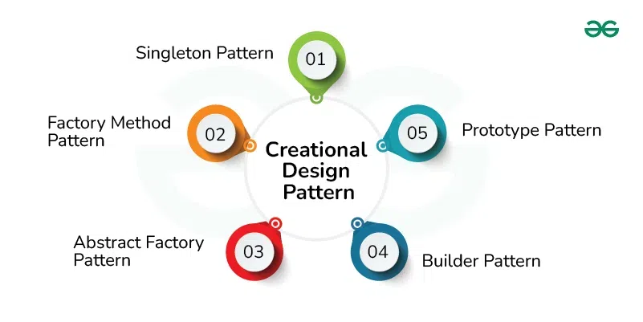

## Looking to the Past

In life, the more experiences we go through, the more problems we encounter. The beautiful thing is that, more often than not, people in the past have faced similar challenges and found solutions or patterns to address them. New generations are able to leverage this knowledge to build solid foundations in whichever endeavor they choose to pursue. These solutions can serve as frameworks or building blocks for larger and more complex systems to be constructed upon. This concept is especially prevalent in the world of programming, where a term that encapsulates this idea is called “Design Patterns.”

## Guidance
	
Design patterns in programming are not rigid rules, but rather blueprints for creating efficient and reliable code tailored to the task at hand. They are tried-and-true solutions to recurring problems encountered in the past. While these patterns offer a starting point for solutions, they also allow the designer the flexibility to add their own spin or twist, all while staying within the confines of proven successful designs.
	
## Application

For my group's final project, we are creating an application that aims to connect students within the same classes for study sessions. One of the key components for this to happen is that students need to register the classes they are taking. This includes the course name, instructor, year, and more. If the class has not yet been created or logged into the database, it is automatically added. To avoid duplication, if the class already exists, the system will use the existing data and instance instead. This follows the Factory Design Pattern, as the process of creating course objects is centralized in a factory, ensuring consistency for instances across the application.

Another example we plan to implement, time permitting, involves the Observer Design Pattern. Currently, when a student is enrolled in a class, they can view all available study sessions for that class. However, we want to extend this feature so that whenever a new session is created, all students enrolled in that class will receive a notification. In this case, the study session will act as the subject, and the students will be the observers. The observers will receive updates about new sessions without needing to check manually. Both of these examples help ensure that our code is clean, standardized, and scalable as we continue to develop the application.

## Conclusion

Design patterns are incredibly useful as they provide a solid foundation for our generation to build upon, using tried-and-true solutions to common problems. These patterns are not only valuable in programming, but they also serve as an example that can be applied to various aspects of our lives. They demonstrate the importance of leveraging the guidance and structure from what others have figured out in the past to help shape a successful, reliable, and more triumphant future.
