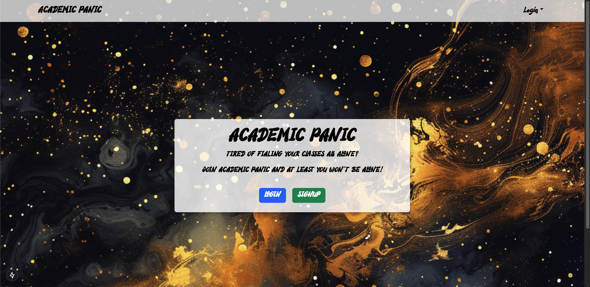
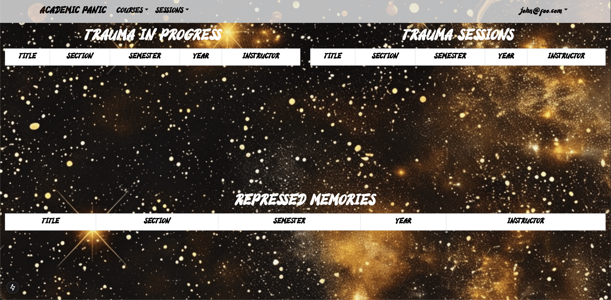
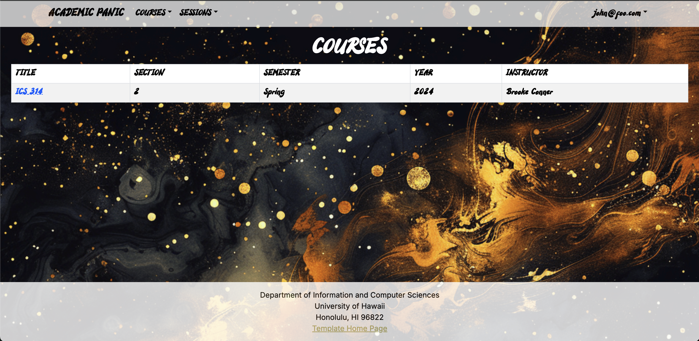

### Academic Panic Overview

  Academic Panic is a web application for UH Manoa students to connect with their peers to engage in more effective and collaborative learning with a study session planning system, course review and rating system, and a “friends” system to connect students without disclosing sensitive information. The goals of the project are as follows; provide UH Manoa students with a collaborative study/tutoring resource, encourage networking and community amongst UH Manoa students, and provide a platform for students to share honest (yet respectful) opinions about courses that will be visible by all users.
  

### Contributions

  In our group we were all helping each other out to build this full stack application, however, for the most part I had a primary focus on front-end design and managing our timeline (project manager). The way I contributed was I helped to design and implement things such as the landing page, "Panic board" (users homepage), NavBar, and ensuring that the design was consistent with our mock ups (implementing fonts, backgrounds, etc.). In addition, I would help to make sure we were hitting our milestones, creating timelines of when things need to get done, and making sure we hit the homepage requirements.
  
### What I learned

 This project taught me about software development, teamwork, and project management. For software development, it taught me all of the stages of creating an application like this from scratch. Going from an idea, features we would want, how it would work, mockups, trying to implement the our idea to code, and working around/with restrictions. Learned how to pivot based on restrictions as well. It refinded my skills with Bootstrap5, learning how to deploy, etc. For teamwork this felt like one of the most organized projects I have been a part of. Taught me how to really be in charge of our own work seperately but come together to bring the project to life (we did still help each other). Lastly, for project management I got practice with using agile project management. I found breaking things into milestones and creating issues to complete them helped to have good communication across the team and ensured we got everything needed done. 

### Project Pages

  Here are a few screenshots of some of our pages. The first is the landing page, second is the "Panicker"'s Panic Board, and third is the course page for the "Panicker"

**Landing Page**

**Panic Board**

**List Courses**

### Project links
- [Project Home Page](https://academic-panic.github.io/)
- [Academic Panic Organization Page](https://github.com/Academic-Panic)
- [Academic Panic Deployment](https://academic-panic-application.vercel.app/)
