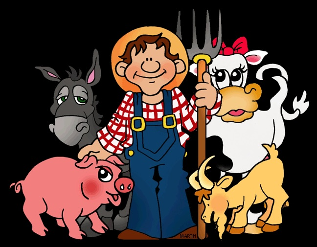

\"Animal Farm\" is a website that I created which is a compilation of labs we went through for our Object-Oriented Programming class, EE 205. This class was taught in C and C++ and was our first introduction into Object-Oriented Programming. These series of labs continuously build on top of each other and progressively examine our knowledge of different concepts and things learned in class.

This project is essentially composed of 7 different labs. The first lab gave us the basics of CLion and GitHub and simple functions. We then moved on to databases and structures, classes and methods, nodes, containers, and singlely linked lists. Then moving onto adding new classes, inheritance, new methods, and more classes. For the last lab we worked on documentation, doing a READMe file, and other documents. With the progression of these labs, they continuously became more difficult and more intesive. We also got into other important aspects like documentation and creating our own tests to ensure our programs are running correctly. Along side real programming skills we learned about the other tasks that comes along with documenting a long term project like this one. This includes things like weekly statistics of the total bytes for files, number of commits, test points, etc. The data structures of the code, about the author, and how someone could improve on this project. Overall this was my first longterm project and not only taught me programming skills but also putting together a display of what the process was and documenting the progress. 

You can see it at [Animal Farm](https://www2.hawaii.edu/~jksamont/ee205_animal_farm/index.html).
