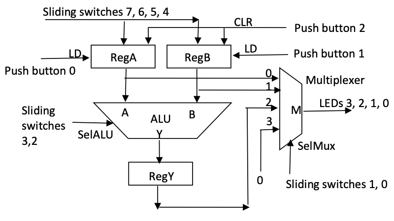
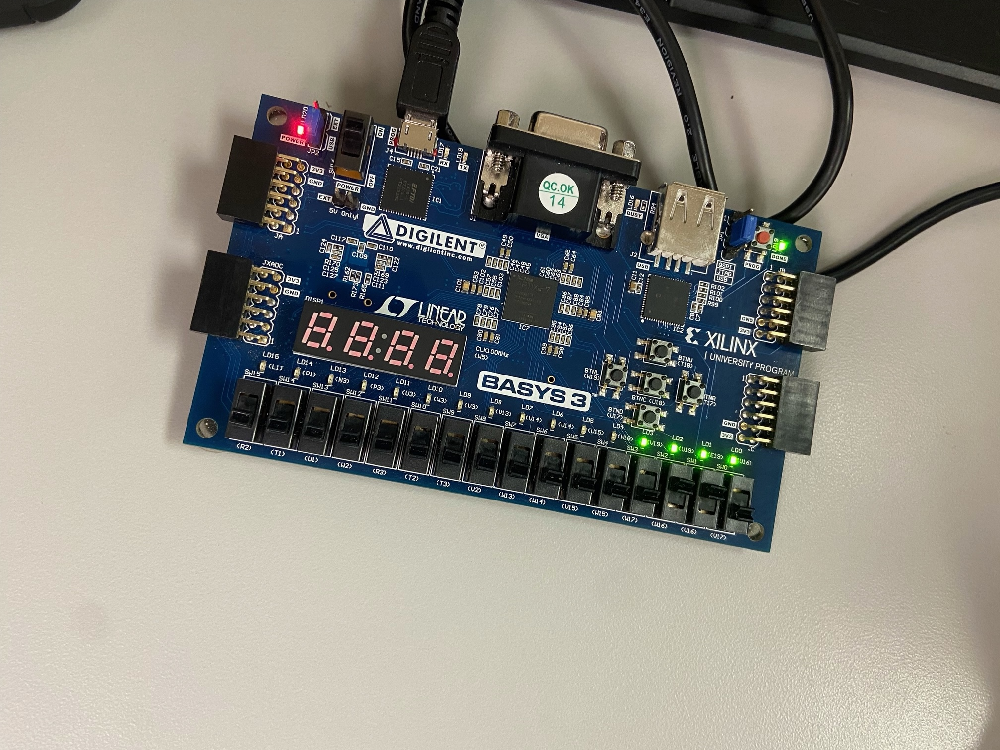

### Background

For those who may not know, an Arithmetic Logic Unit also known as an ALU is an integral part of a computer's central processing unit (CPU). The ALU is tasked with performing tasks such as arithmetic operations such as addition, subtraction, multiplication, division and basic logical functions. ALU is essential for executing computations that enable programs to function.

### Task

The task at hand is to recreate the ALU circuit shown in the picture above and impliment it on the Basys3 board. This circuit consisted of registers, a 4-bit ALU, and a 4:1 multiplexer. After disecting the image, we began coding within SystemVerilog. We decided to split the parts into their respected units and work on them one at a time. We first created the "module alu" which defines the logic to select what type of operation we want the ALU to perform. Next we made the module for the registers A and B using "module red_mod". This module lets us load and clear bits into these registers. We then created the 4:1 multiplexer which essentially chose which output that will be selected and shown by the LEDs. We finally created the last module, "topModule". Within this module is where all the other modules are essentially called and everything is "wired" together to create the circuit. From here we just had to correctly set up the Basys board by setting things like the buttons, switches, and LEDs using Xilinix Vivado. Though you cannot completely tell through the image on the bottom, we were able to successfully implement the ALU circuit onto our board.

### Takeaways

The main takeaway from this was I really hate SystemVerilog. Just kidding...not really. But on a serious note, though it was tough and confusing at times it was deeply satisfying to see the circuit come to fruition on the board. I think that this was probably one of my favorite Verilog labs just because I saw the real application of it and was able to make something pretty complex and important come to life on the board. Overall I felt that this lab really solidified my understanding of the applications, the language, and the programming of the board.

You can learn more in detail of what was done here: [FPGA lab Report](https://drive.google.com/file/d/1d9tWdNzbXhQwsfkr4FTGhvMkdNt74Khm/view?usp=sharing).
